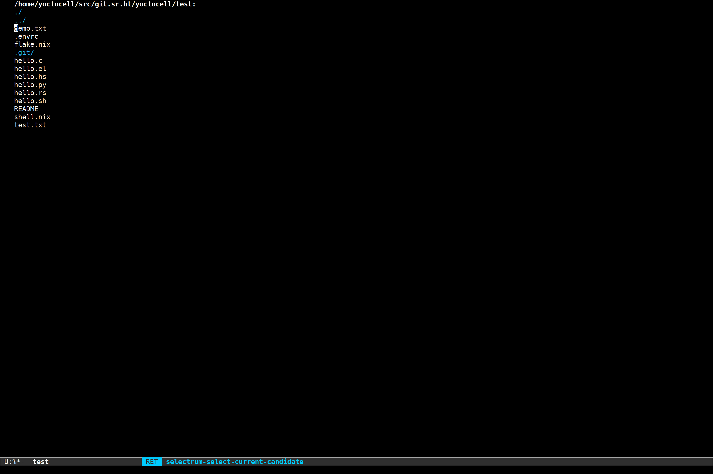

# Introduction
`git-email` integrates git and email with Emacs, it offers two main
functions for sending email with git.

-   `git-email-send-email` will send the marked files as patches using your
    mail client of choice.  This means that you have to first run
    `git format-patch` to generate the patches.

-   `git-email-format-patch` will ask you for a base revision and generate
    patches for all the changes that occured between the revision and
    the current HEAD.  It will then prepare the patches as email
    messages in the same way as `git-email-send-email`.

If you want to easily apply patches you have recieved via email, you
should checkout [piem](https://git.kyleam.com/piem).

See the [manual](https://yoctocell.xyz/doc/git-email/) for more details.

# Demo

# Contributing
You can send patches and bug reports to the
[git-email-devel](https://lists.sr.ht/~yoctocell/git-email-devel)
mailing list.
